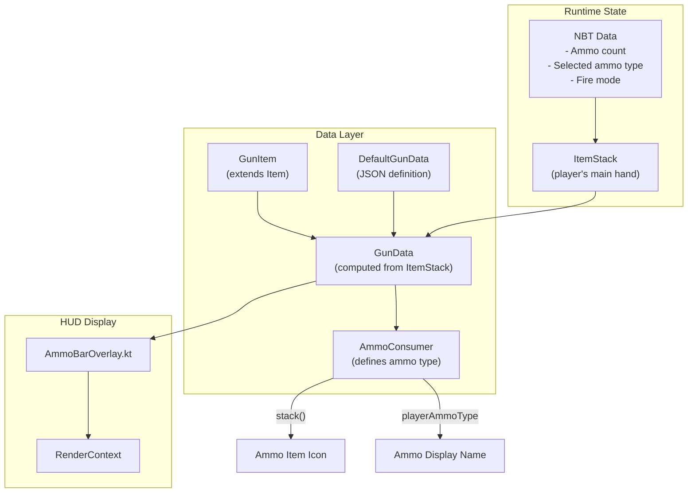
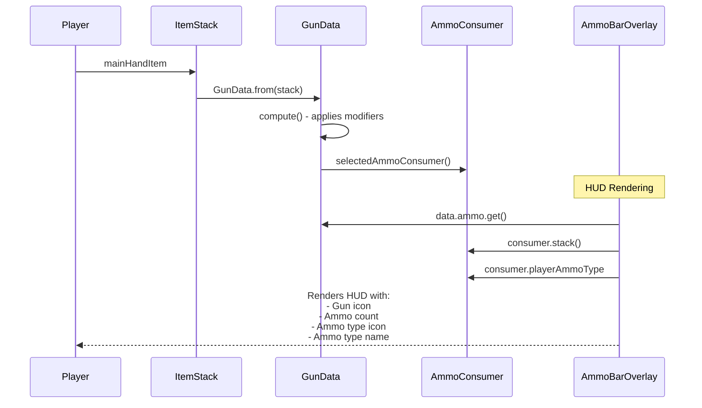
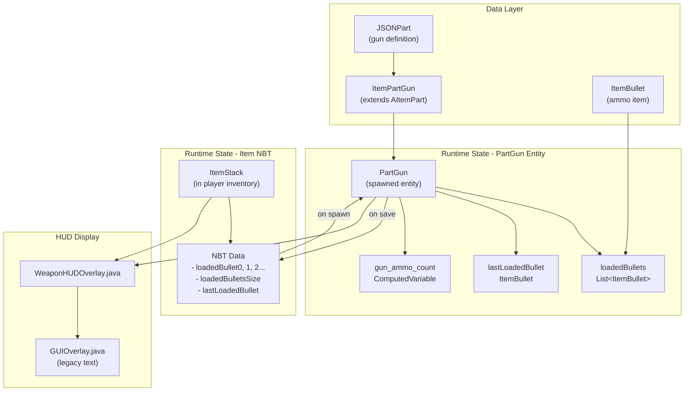
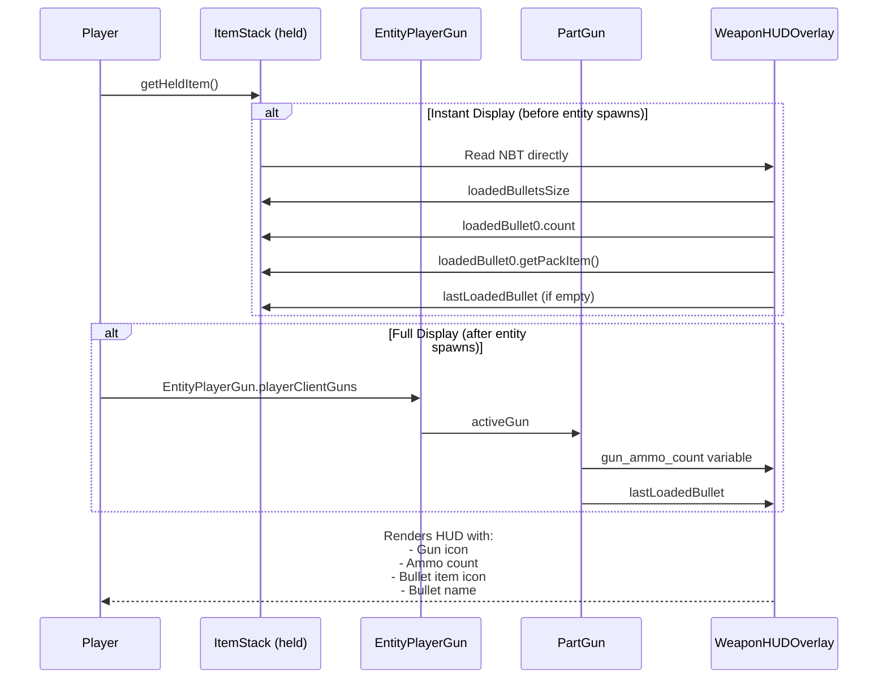
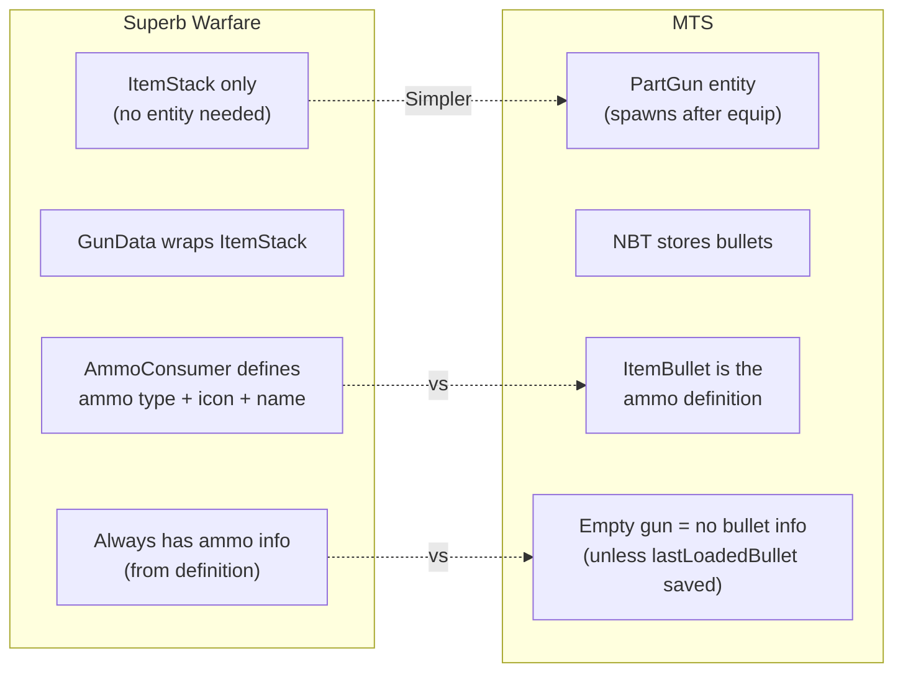
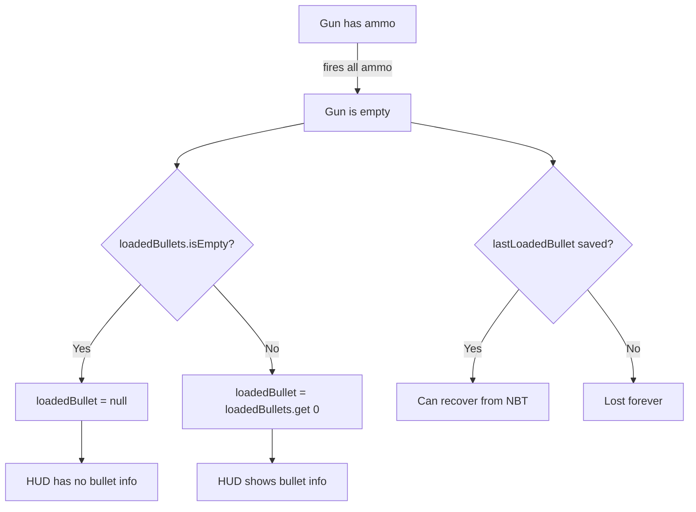

# Ammo System Comparison: Superb Warfare vs MTS

## Overview

This document compares how Superb Warfare and MTS handle ammunition systems, particularly for HUD display.

---

## Superb Warfare Ammo System

### Architecture



### Key Data Flow



### Superb Warfare Ammo Sources

| Source | Description | Example |
|--------|-------------|---------|
| `GunData.ammo.get()` | Current magazine ammo count | `32` |
| `GunData.selectedAmmoConsumer()` | Current ammo type definition | Returns `AmmoConsumer` |
| `AmmoConsumer.stack()` | ItemStack for the ammo type | `ItemStack(rifle_ammo)` |
| `AmmoConsumer.playerAmmoType` | Enum for player ammo types | `Ammo.RIFLE` |
| `getAmmoDisplayName(data)` | Display name for HUD | `"5.56mm Rifle"` |

### Superb Warfare JSON Definition (gun)

```json
{
  "AmmoConsumers": [
    {
      "Ammo": "@Rifle",           // Player ammo type
      "AmmoSlot": "Default"
    },
    {
      "Ammo": "superbwarfare:ap_ammo",  // Specific item
      "AmmoSlot": "AP"
    }
  ]
}
```

---

## MTS Ammo System

### Architecture



### Key Data Flow



### MTS Ammo Sources

| Source | Description | Example |
|--------|-------------|---------|
| `gun.getOrCreateVariable("gun_ammo_count")` | Total ammo in gun | `500` |
| `gun.lastLoadedBullet` | Currently loaded bullet type | `ItemBullet` |
| `gun.loadedBullets` | List of loaded bullet types | `List<ItemBullet>` |
| `gun.loadedBulletCounts` | Count per bullet type | `List<Integer>` |
| NBT `loadedBullet{i}` | Serialized bullet data | `{packID, systemName, count}` |
| NBT `lastLoadedBullet` | Last used bullet (persists when empty) | `{packID, systemName}` |

### MTS JSON Definition (gun)

```json
{
  "gun": {
    "capacity": 500,
    "preloadedBullet": "mtsofficialpack:extinguisherfoam:1",
    "diameter": 10.01
  },
  "gunHUD": {
    "enabled": true,
    "weaponDisplay": {
      "showIcon": true,
      "iconTexture": "mtsofficialpack:textures/gun_icon/fireextinguisher_icon.png"
    },
    "ammoDisplay": {
      "showCount": true
    }
  }
}
```

---

## Key Differences



### Comparison Table

| Aspect | Superb Warfare | MTS |
|--------|---------------|-----|
| **Ammo Definition** | `AmmoConsumer` in gun JSON | Separate `ItemBullet` items matched by diameter/caseLength |
| **Ammo Type Storage** | `selectedAmmoType` index | `loadedBullets` list |
| **Empty Gun Display** | Always shows ammo type (from definition) | Shows nothing unless `lastLoadedBullet` is saved |
| **Ammo Icon** | `AmmoConsumer.stack()` or player ammo type | `loadedBullet.getNewStack()` item texture |
| **Ammo Name** | `getAmmoDisplayName(data)` from consumer | `loadedBullet.getItemName()` |
| **Instant Display** | Yes - reads from ItemStack NBT | Partial - reads NBT but needs entity for full data |
| **Preloaded Ammo** | Defined in AmmoConsumer | `preloadedBullet` in gun JSON |

---

## The Problem with MTS Empty Gun Display

### Current Issue

When an MTS gun is **empty** (0 ammo), the HUD shows:
- ✅ Gun icon (from `iconTexture` or item texture)
- ✅ Gun name
- ✅ Ammo count = 0
- ❌ **No ammo type name** (because `loadedBullet` is null)
- ❌ **No ammo icon** (because no bullet to get item texture from)

### Why It Happens



### Superb Warfare Solution

Superb Warfare **always** has ammo type info because:

1. `AmmoConsumer` is defined in the gun's JSON
2. `selectedAmmoConsumer()` always returns a valid consumer
3. Even with 0 ammo, `consumer.stack()` and `consumer.playerAmmoType` are available

```kotlin
// Superb Warfare - Always has ammo info
val consumer = data.selectedAmmoConsumer()  // Never null
val ammoStack = consumer.stack()            // Always valid
val ammoName = getAmmoDisplayName(data)     // Always returns something
```

### MTS Current Behavior

```java
// MTS - Can be null when empty
ItemBullet loadedBullet = gun.lastLoadedBullet;  // May be null!
String ammoName = loadedBullet != null ? loadedBullet.getItemName() : "";  // Empty string
```

---

## Recommended MTS Fixes

### Option 1: Use `preloadedBullet` as Fallback

When `lastLoadedBullet` is null, fall back to the gun's `preloadedBullet` definition:

```java
ItemBullet loadedBullet = gun.lastLoadedBullet;
if (loadedBullet == null && gun.definition.gun.preloadedBullet != null) {
    String[] parts = gun.definition.gun.preloadedBullet.split(":");
    loadedBullet = PackParser.getItem(parts[0], parts[1]);
}
```

### Option 2: Add `defaultAmmoType` to JSONGunHUD

Allow pack makers to specify a display-only ammo type:

```json
{
  "gunHUD": {
    "ammoDisplay": {
      "defaultAmmoType": "mtsofficialpack:extinguisherfoam"
    }
  }
}
```

### Option 3: Ensure `lastLoadedBullet` is Always Saved

Make sure PartGun saves `lastLoadedBullet` to NBT even after all ammo is consumed, and restores it on load.

---

## Summary

| Feature | Superb Warfare | MTS Current | MTS Recommended |
|---------|---------------|-------------|-----------------|
| Empty gun shows ammo type | ✅ Always | ❌ No | Use `preloadedBullet` fallback |
| Ammo icon when empty | ✅ Always | ❌ No | Use `preloadedBullet` fallback |
| Defined in gun JSON | ✅ AmmoConsumer | ⚠️ preloadedBullet only | Add to gunHUD or use existing |
| Multiple ammo types | ✅ AmmoConsumer list | ✅ loadedBullets list | Works |
| Instant HUD display | ✅ Yes | ✅ Yes (after fix) | Works |
